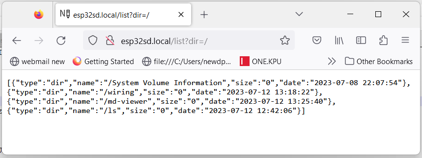
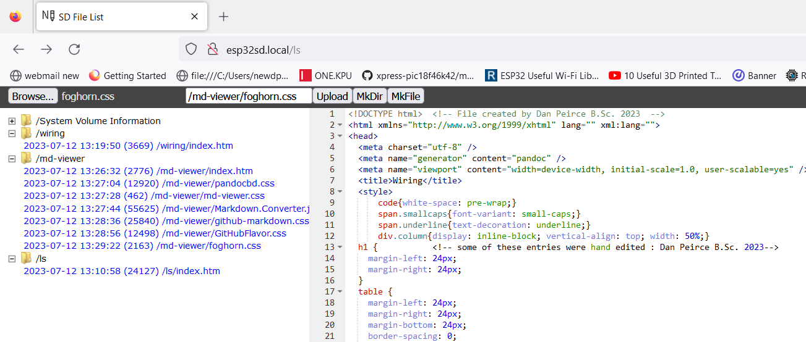

# ESP32_SDWebServer

ESP32_SDWebServer is a modified version of the example code SDWebServer. 

Changes made to date

* Made column for file listing wider.
* Added WebManager
* Added time set via NTP

## Added File Size and Date to JASON

* example output

~~~~C++
231 |    time_t t= entry.getLastWrite();
232 |    struct tm * tmstruct = localtime(&t);
233 |    static char datebuff[30];
234 |    sprintf(datebuff, "%d-%02d-%02d %02d:%02d:%02d",(tmstruct->tm_year)+1900,( tmstruct->tm_mon)+1, tmstruct->tm_mday,tmstruct->tm_hour , tmstruct->tm_min, tmstruct->tm_sec);
235 |
236 |    String output;
237 |    if (cnt > 0) {
238 |      output = ',';
239 |    }
240 |
241 |    output += "{\"type\":\"";
242 |    output += (entry.isDirectory()) ? "dir" : "file";
243 |    output += "\",\"name\":\"";
244 |    output += entry.path();
245 |    output += "\",\"size\":\"";
246 |    output += entry.size();
247 |    output += "\",\"date\":\"";
248 |    output += String(datebuff);
249 |    output += "\"";
250 |    output += "}";
251 |    server.sendContent(output);
252 |    entry.close();
253 |  }
254 |  server.sendContent("]");
255 |  dir.close();
~~~~

## Added File Size and Date to List Index Page

This required the JASON to be updated first!

index.htm file in **ls** folder

See lines 375 and 379 below:

~~~~javascript
375 |   function createTreeLeaf(path, name, size, date){
376 |     var leaf = document.createElement("li");
377 |     leaf.id = name.toLowerCase();
378 |     var label = document.createElement("span");
379 |     label.textContent = date + " (" + size + ") "  + name;
380 |     leaf.appendChild(label);
381 |     leaf.onclick = function(e){
382 |       if(isTextFile(leaf.id)){
383 |         editor.loadUrl(leaf.id);
384 |       } else if(isImageFile(leaf.id)){
385 |         loadPreview(leaf.id);
386 |       }
387 |     };
388 |     leaf.oncontextmenu = function(e){
389 |       e.preventDefault();
390 |       e.stopPropagation();
391 |        showContextMenu(e, leaf.id, true);
392 |     };
393 |     return leaf;
394 |   }
~~~~

## Display Character Case as Saved

Previous behaviour was to change all characters to lower case when displaying filenames and folder names.

## Allow longer file Names.

The default behaviour was to truncate file names to 8 characters as in the old DOS 8.3 format. Specifically after browsing and choosing a file for uploading added
a truncated version of the file name was appearing in the text-box for the file name that would appear on the micrSD file system. One was alowed to edit the truncated 
name back to the original but that was a nuisance. Note one must still add the new path to the file name.

Using FAT32 there is no reason to 
limit file names in that way. I have extended the file name up to 25 characters.

~~~~javascript
233 |       if(typeof name !== undefined){
234 |       if(name.length > 25) name = name.substring(0, 25);
235 |       filename = name;
~~~~

## Restructured Folders and Names

Removed **edit** folder and replaced it with **ls** folder.
This project is not useful as an editor but it is good for listing folder/file structure and contents. 

## ESP32-S2 to microSD Breakout Board Wiring

| Pin breakout | microSD | SPI  | BREAKOUT BOARD CN0023 | Description (for breakout)                                                                  | ESP32-S2 | PIN ESP32-S2 |
|--------------|---------|------|-----------------------|---------------------------------------------------------------------------------------------|----------|--------------|
| 1            | DAT2    | X    |                       | Suggested 50K pullup on unused input                                                        |          |              |
| 2            | CD/DAT3 | CS   | CS                    |                                                                                             | SS       | 34           |
| 3            | CMD     | DI   | DI                    |                                                                                             | MOSI     | 35           |
| 4            | VDD     | VDD  | VDD                   | 3.3 VDC                                                                                     | VDD      | 3V3          |
| 5            | CLK     | SCLK | SCLK                  |                                                                                             | SCK      | 36           |
| 6            | VSS     | VSS  | VSS                   | GROUND                                                                                      | VSS      | G            |
| 7            | DAT0    | D0   | D0                    |                                                                                             | MOSO     | 37           |
| 8            | DAT1    | X    |                       | Suggested 50K pullup on unused input                                                        |          |              |
| 9            |         |      | /SW                   | Switch that indicates a card is inserted. Connects to SW_GND when card inserted. Not using. |          |              |
| 10           |         |      | SW_GND                | Connect to system ground                                                                    |          |              |

