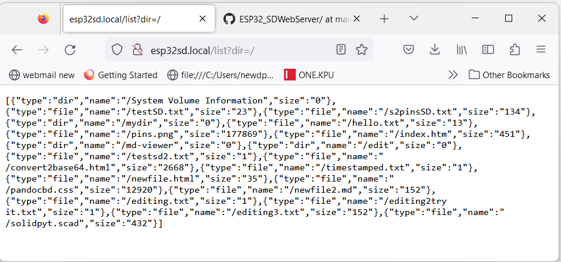
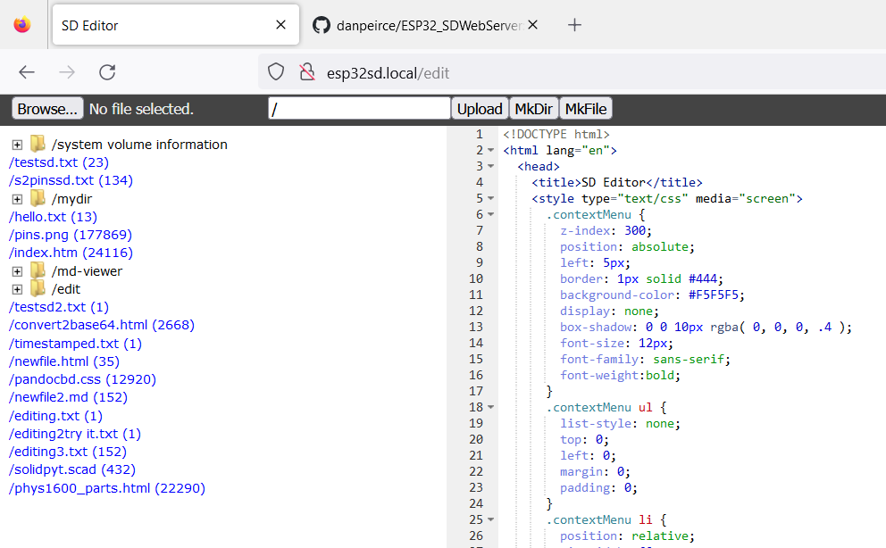
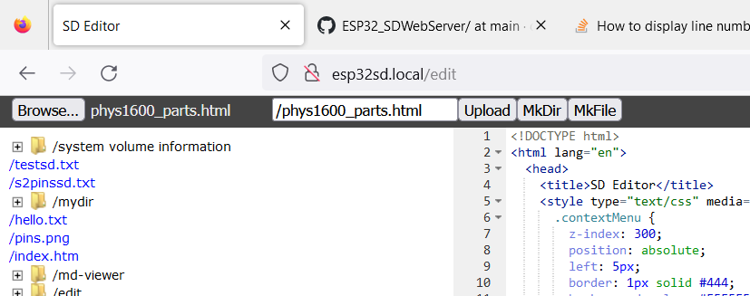

# ESP32_SDWebServer

ESP32_SDWebServer is a modified version of the example code SDWebServer. 

Changes made to date

* Made column for file listing wider.
* Added WebManager
* Added time set via NTP

Looking to see if I can added dates and file sizes to file listing.

## Added File Size to JASON

* example output

## Added File Size to Edit Index Page

This required the JASON to be updated first!

## Allow longer file Names.

The default behaviour was to truncate file names to 8 characters as in the old DOS 8.3 format. Specifically after browsing and choosing a file for uploading added
a truncated version of the file name was appearing in the textbox for the file name that would appear on the micrSD file system. One was alowed to edit the truncated 
name back to the original but that was a nuisance. Note one nust still add the new path to the file name.

Using FAT32 there is no reason to 
limit file names in that way. I have extended the file name up to 25 characters.

~~~~javascript
233 |       if(typeof name !== undefined){
234 |       if(name.length > 25) name = name.substring(0, 25);
235 |       filename = name;
~~~~

